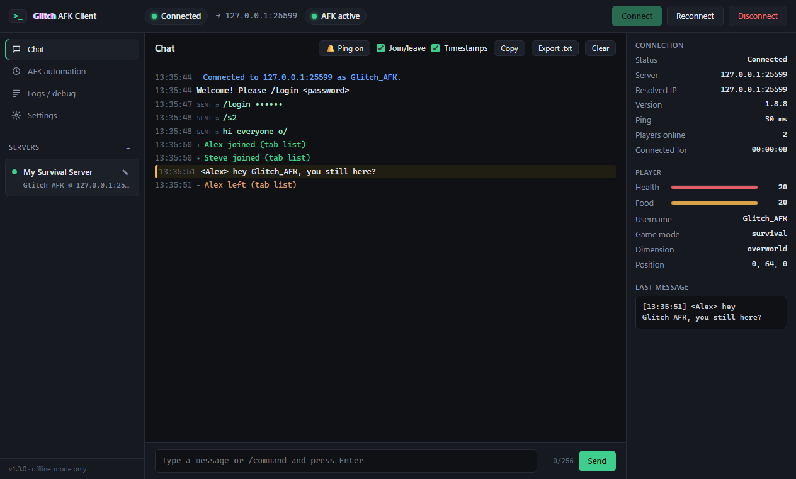

<div align="center">


# Glitch AFK Client

**Stay AFK on Minecraft servers without running Minecraft.**
Chat, auto-login, auto-reconnect and anti-AFK in a tiny Windows app.

### [⬇ Download for Windows](https://github.com/8Glitchh/Glitch-AFK-Client/releases/latest/download/Glitch-AFK-Client-Setup.exe)

<sub>Windows 10/11 · 64-bit · free · [portable version](https://github.com/8Glitchh/Glitch-AFK-Client/releases/latest/download/Glitch-AFK-Client-Portable.exe) · [all releases](https://github.com/8Glitchh/Glitch-AFK-Client/releases)</sub>



</div>

---

A lightweight, render-free **Minecraft Java Edition** console client for staying AFK on servers that allow **offline-mode (username-only) connections**.

It shows chat, player stats and connection info, sends your join commands, reconnects automatically, and can do small anti-AFK movements. It **never renders the world**: no 3D, no textures, no chunks drawn. It uses a few hundred MB of RAM and next to no CPU/GPU, versus several GB for the real game.

> **Offline mode only.** This app connects with just a username, so it only works on servers configured with `online-mode=false` (or behind a proxy that allows it). It does **not** implement, request or bypass Microsoft/Mojang authentication, and never asks for a Microsoft password.

---

## Download (Windows)

1. **[Download `Glitch-AFK-Client-Setup.exe`](https://github.com/8Glitchh/Glitch-AFK-Client/releases/latest/download/Glitch-AFK-Client-Setup.exe)** and run it.
2. It installs for your user only (no admin needed) and adds a **desktop shortcut** and a **Start-menu entry**. Open it from there like any other program.
3. To uninstall: *Windows Settings → Apps → Glitch AFK Client*.

No install wanted? Grab **[`Glitch-AFK-Client-Portable.exe`](https://github.com/8Glitchh/Glitch-AFK-Client/releases/latest/download/Glitch-AFK-Client-Portable.exe)** and double-click it.

> Windows SmartScreen may warn because the executable isn't code-signed. Choose *More info → Run anyway*, or sign it yourself (see below).

## Quick start

1. Click **＋** next to *Servers*, then enter the address, port (default 25565) and username (1–16 letters/digits/_). Leave the version on **Auto detect** unless the server needs a specific one.
2. Optional: add **join commands** with delays, e.g.
   - `3` s → `/login {{password}}`
   - `6` s → `/s2`

   Put your login password in the **Login password** field, **not** in the command. `{{password}}` is replaced at send time.
3. **Save & connect.** Chat appears in the middle, and player and connection info on the right.
4. Open **AFK automation** to start or stop anti-AFK actions whenever you like.

## Features

| Area | What you get |
|---|---|
| Connection | Address/port/username, version selector with auto-detect, connect / disconnect / reconnect, live status, visible network destination (and resolved IP), clear error messages |
| Reconnect | Auto-reconnect with exponential back-off (±10% jitter) or fixed delay, max delay, max attempts, optional "reconnect after kick"; back-off resets after 60 s online |
| Chat | Colour-coded server chat, system messages, join/leave (tab list) events with a one-click **Join/leave** on/off toggle, your own sent messages, `/commands`, ↑/↓ history, clear / copy / export `.txt`, optional timestamps |
| AFK | Interval + jitter, a small step forward *and back* (no drift), small camera rotation, jump, sneak, arm swing; start/stop independent of the connection (waits and resumes across reconnects); optional auto-start per server |
| Info | Server version, username, health, food, position, dimension, game mode, ping, online players, time connected, last message, connection status |
| Logs/debug | Connection, login/spawn, disconnect, kick, error and reconnect events; debug mode adds raw protocol packets (noisy ones filtered, rate-limited) |
| Profiles | Unlimited saved servers with reconnect, AFK and join-command settings |

## Privacy & security

- **The only network connection** is to the Minecraft server you choose, shown in the top bar. No analytics, telemetry or update checks.
- **Passwords are not saved by default.** A password you enter stays in memory until you quit. If you tick **Remember securely**, it's encrypted with Electron `safeStorage`, which uses **Windows DPAPI** (macOS Keychain / Linux libsecret), and only the encrypted blob is written to disk. If OS encryption isn't available the app refuses to save it rather than fall back to plaintext.
- The stored password is never sent back to the UI. It's only substituted into `{{password}}` join commands sent to *that* server. `/login` and `/register` arguments are masked in chat and logs.
- Nothing the server sends is executed. Chat is displayed as plain text (`textContent`) with a strict Content-Security-Policy; the renderer is sandboxed with no Node access.
- Server address, port and username are validated before connecting.

### What is stored locally

In `%APPDATA%\Glitch AFK Client\` (Settings → *Open data folder*):

| File | Contents |
|---|---|
| `profiles.json` | Server name, host, port, username, version, reconnect/AFK/join-command settings. **No passwords.** |
| `settings.json` | App settings |
| `secrets.json` | Only if you chose *Remember securely*: DPAPI-encrypted passwords per server |

Chat and logs live in memory (capped ring buffers) unless you export them.

## Performance notes

- No renderer, no world view, no textures. Hardware acceleration is disabled.
- Asks the server for the smallest view distance ("tiny") to minimise chunk memory.
- **Low-memory mode** (default on) skips Mineflayer features this app never uses (digging, crafting, containers, sounds, particles, …).
- Status is pushed to the UI only when it changes. UI updates are batched every 100 ms, and chat/log history is capped.
- Every timer and listener is tracked and released on disconnect. A connection generation counter guarantees only one bot exists at a time, and stale events are ignored.
- The Minecraft connection is closed cleanly when the app exits.
- Optional: *close to tray* and *block app suspension while connected* for multi-day sessions.

Measured on Windows 11 while connected with AFK running: ~350 MB total working set across Electron's 4 processes, with CPU effectively idle.

## Development

Requirements: **Node.js 20+** (tested with 24) and npm.

```bash
npm install
npm start          # run the app
npm run check      # syntax + unit + end-to-end test against a local throwaway server
```

`npm run check` starts a temporary offline-mode server on `127.0.0.1` and tests the real connection code: spawn, join commands and `{{password}}` substitution, password masking, chat both ways, info data, AFK actions, kick → auto-reconnect, no duplicate connections, clean disconnect with no leftover timers, and connection-refused errors.

> **npm 11+ note:** if `npm start` prints *Downloading Electron binary…*, that's Electron fetching its runtime on first run, which is expected when install scripts are blocked.

### Build the Windows installer

```bash
npm run dist
```

Output in `dist/`:
- `Glitch-AFK-Client-Setup.exe`: installer (per-user, desktop + Start-menu shortcuts, uninstaller)
- `Glitch-AFK-Client-Portable.exe`: single-file portable build

File names have no version number on purpose: the README's download buttons point to `releases/latest/download/<file>`, so they always get the newest release. For a new release, bump `version` in `package.json`, run `npm run dist`, and upload both files to a new GitHub release.

`npm run pack` builds an unpacked folder (`dist/win-unpacked`) for quick testing. To regenerate the icon: `node scripts/make-icon.js`. To code-sign, set `CSC_LINK` / `CSC_KEY_PASSWORD` before `npm run dist` (see electron-builder docs).

## Project layout

```
src/
  main/
    main.js         Electron main: window, tray, IPC, lifecycle, batching
    botManager.js   The single Mineflayer bot: connect, reconnect/back-off, chat, info, cleanup
    afk.js          Anti-AFK controller (independent start/stop, tracked timers)
    store.js        profiles.json / settings.json (atomic writes)
    secrets.js      OS-encrypted password storage (safeStorage / DPAPI)
    validate.js     Validation & normalisation of all renderer input
    ringBuffer.js   Fixed-size history buffers
  preload/preload.js  Minimal, whitelisted API exposed to the UI
  renderer/           index.html, styles.css, app.js, format.js (no framework)
scripts/
  check.js          Self-test suite
  make-icon.js      Generates assets/icon.png
```

## Troubleshooting

| Message | Meaning |
|---|---|
| *Connection refused* | Server offline or wrong port |
| *Server address not found* | DNS failed. Check the hostname |
| *Kicked: …You are not white-listed / Failed to verify username* | The server is in online mode or whitelisted, so offline clients can't join |
| *Server version 'x' is not supported* | Pick a supported version, or the server is newer than Mineflayer supports |
| *No login within 45s* | Server didn't respond to login (firewall, proxy, wrong version) |
| *Skipped "/login {{password}}": no password set* | Enter the password in the server's settings |

Use the **Logs / debug** tab (with Debug mode on) for details.

## License

MIT. Not affiliated with Mojang or Microsoft. "Minecraft" is a trademark of Mojang Synergies AB.
